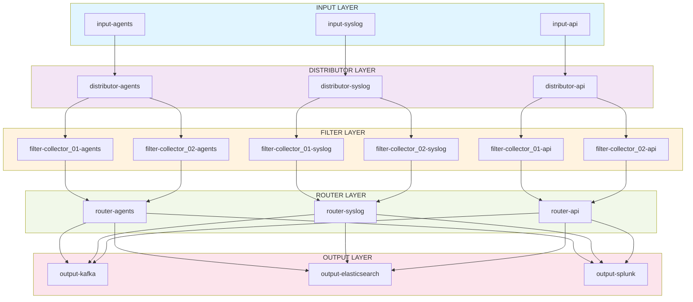

# Logstash Ingress Pipeline Architecture - Design

## Architecture Layers

```
INPUT LAYER
  ├─ input-agents
  ├─ input-syslog
  └─ input-api
         ↓
DISTRIBUTOR LAYER
  ├─ distributor-agents
  ├─ distributor-syslog
  └─ distributor-api
         ↓
FILTER LAYER (collector-specific)
  ├─ filter-collector_01-agents
  ├─ filter-collector_01-syslog
  ├─ filter-collector_01-api
  ├─ filter-collector_02-agents
  ├─ filter-collector_02-syslog
  ├─ filter-collector_02-api
  └─ [add more collectors as needed]
         ↓
ROUTER LAYER
  ├─ router-agents
  ├─ router-syslog
  └─ router-api
         ↓
OUTPUT LAYER
  ├─ output-kafka
  ├─ output-elasticsearch
  └─ output-splunk
```




## Layer Responsibilities

| Layer | Role | Example |
|-------|------|---------|
| **INPUT** | Receive from sources | Listen on ports, protocols |
| **DISTRIBUTOR** | Tag metadata, route to collector filters | Add collector_id, source_type |
| **FILTER** | Collector-specific parsing/enrichment | Windows vs Linux logic |
| **ROUTER** | Route to outputs based on metadata | Which events go where |
| **OUTPUT** | Send to destinations | Kafka, ES, Splunk |

## Total Pipeline Count

- **Inputs:** 3
- **Distributors:** 3
- **Filters:** 6+ (scales with collectors)
- **Routers:** 3
- **Outputs:** 3

**Minimum: 18 pipelines** (for 2 collectors)
